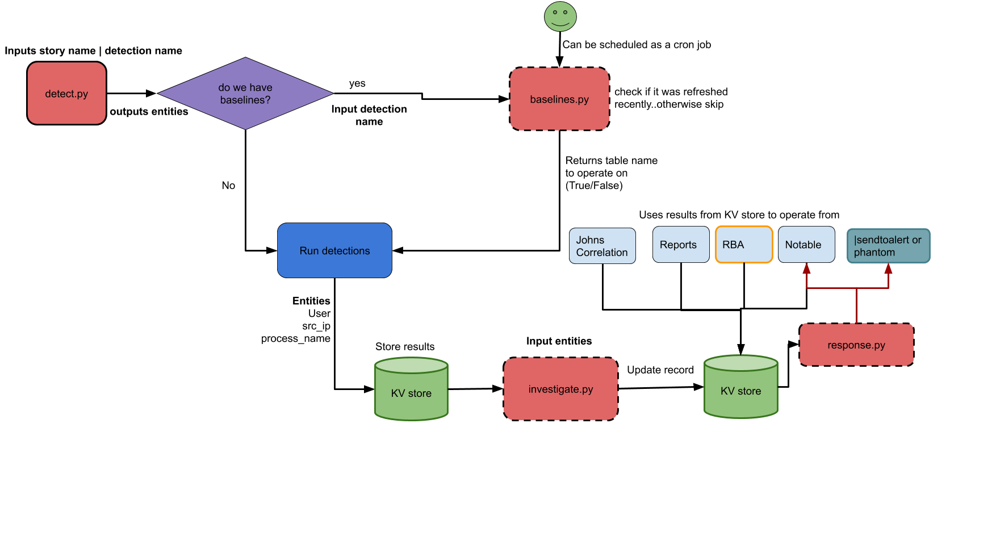

# Analytic Story Execution (ASX)

----

## Description: 

This application gives you the tools to make the execution of an Analytic Story in Splunk an automated process. It's as easy as selecting an Analytic Story and clicking "Submit!"

**Benefit:** Instead of running each search individually, analysts can use this app to execute and preview the results of executing an Analytic Story end-to-end in their environments.

**Value:** Security analysts gain use-case relevant context and correlation when detection events are generated and can automatically trigger the investigative searches from that analytic story to bring back more information about the triggered detection

**Not sure what an Analytic Story is?!** 

Check out the [ES Content Updates](https://splunkbase.splunk.com/app/3449/ app on SplunkBase to explore Analytic Stories in Splunk 

**OR**

Check out the Splunk open-source [security-content](https://github.com/splunk/security-content) repository on GitHub, where you can explore/contribute and learn how to build your own Analytic Story! Go forth and conquer!!

## Custom Search Commands:

There are two custom commands in this app that will help you automatically detect and investigate Analytic Stories in your Splunk evnvironment:

----

**1) detect:** 
This is a [Custom Search Generating command](https://dev.splunk.com/enterprise/docs/developapps/customsearchcommands/) that runs all baseline and detection searches in an Analytic Story. 

Syntax:
```
| detect story="<analytic_story_name>" | `format_detection_results`
```

Example:
```
| detect story="Malicious Powershell" | `format_detection_results`
```

***Note**: The `format_detection_results` is a macro that leveraged to format the detection results for friendly display of field names.
The `detect` command will always create a new baseline, so beware that this command will overwrite your previous baselines( working on improving this)


##### [Detection Result Object Example](https://github.com/splunk/analytic_story_execution/blob/develop/README/detection_result_object_example.json)


----

**2) investigate**
This is a [Custom Search Streaming command](https://dev.splunk.com/enterprise/docs/developapps/customsearchcommands/) that runs all investigative searches on all the `entities` generated using the `detect` command.

Syntax:
```
| detect story="<analytic_story_name>" | `format_detection_results` | investigate | `format_investigation_results`
```

Example:
```
| detect story="Malicious Powershell" | `format_detection_results`| investigate | `format_investigation_results`
```

***Note**:  `investigate` is a streaming command and can be only executed after the `detect` command has generated the result object. The `format_investigation_results` is a macro that leveraged to format the investigation results for friendly display of field names.

----


## Architecture

This architecture diagram show cases how the different modules are integrated to facilitate the end to end execution of an analytic story 



## Installation

1. Download the [latest release](https://github.com/splunk/analytic_story_execution/releases) and install on your Splunk Search Head
2. If you do not have Analytic Stories in your Splunk environment, the Splunk Research team regularly releases security analytic stories via [ES Content Updates](https://splunkbase.splunk.com/app/3449/). We recommend you to install the ESCU application to get started quickly.

## Prerequisites

As of today, the custom search commands leverages specific `key:value` pairs from savedsearches.conf. Please ensure that your savedsearches.conf file has the following:
 Spec: [savedsearches.conf.spec](https://github.com/splunk/analytic_story_execution/blob/develop/README/savedsearches.conf.spec)
 Example: [savedsearches.conf](https://github.com/splunk/analytic_story_execution/blob/develop/README/savedsearches.conf.example)


## Support
Please use the [GitHub issue tracker](https://github.com/splunk/analytic_story_execution/issues) to submit bugs or request features.

If you have questions or need support, you can:

* Post a question to [Splunk Answers](http://answers.splunk.com)
* Join the [#security-research](https://splunk-usergroups.slack.com/messages/C1RH09ERM/) room in the [Splunk Slack channel](http://splunk-usergroups.slack.com)
* If you are a Splunk Enterprise customer with a valid support entitlement contract and have a Splunk-related question, you can also open a support case on the https://www.splunk.com/ support portal

## Author
* [Jose Hernandez](https://twitter.com/d1vious)
* [Bhavin Patel](https://twitter.com/hackpsy)


## Contributing
We welcome feedback and contributions from the community! Please see our [contribution guidelines](docs/CONTRIBUTING.md) for more information on how to get involved. 
