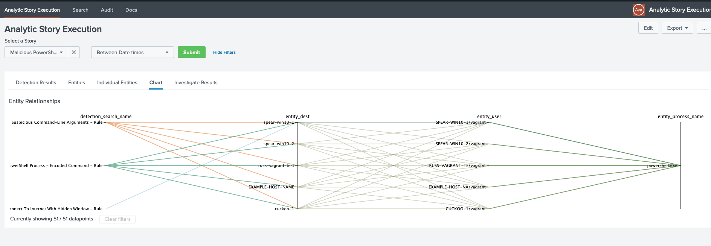

# Analytic Story Execution 


**Benefit** Instead of running each search individually, analysts can use this app to execute an Analytic Story end-to-end in their environments. 

**Value** Security analysts gain use-case relevant context and correlation when events are generated.



It is as easy as selecting a Analytics Story clicking submit! This application gives you the tools to make the execute an analytic story in Splunk an automated process. There are two custom commands in this app that will help you to detect and investigate scenarios in your dataset automatically:

### Detect

```
detect story="Malicious Powershell" | `format_detection_results`
```

Run all detection searches beloning in an analytic story and store results the KV store collection `detect_kvstore`. Also returns the following object for each detection search:

##### [Object Example](https://jsoneditoronline.org/?id=5527dddc593545baa60c5cfd4b10b2f0)


### Investigate

`| investigate `

Run all investigative searches belonging to a analytics story detection results. Note that `investigate` is a streaming command and can be excuted after detect for example: 

```
detect story="Malicious Powershell" 
| `format_detection_results` 
| investigate 
| mvexpand investigation_results 
| spath output=investigation_search_name input=investigation_results path=investigation_search_name 
| spath output=investigation_result input=investigation_results path=investigation_result{} | stats count values(investigation_result) as investigation_result by investigation_search_name
```

# Architectural Flow Diagram
