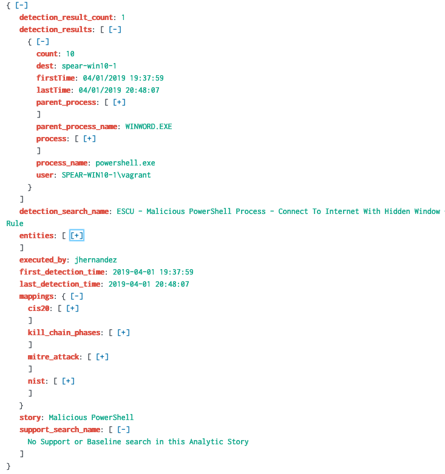

# Analytic Story Execution (ASX)

----

## Description: 

This application gives you the tools to make the execution of an Analytic Story in Splunk an automated process. It's as easy as selecting an Analytic Story and clicking "Submit!"

**Benefit:** Instead of running each search individually, analysts can use this app to execute an Analytic Story end-to-end in their environments.

**Value:** Security analysts gain use-case relevant context and correlation when detection events are generated and can automatically trigger the investigative searches from that analytic story to bring back more information about the triggered detection

----


## Tools:

There are two custom commands in this app that will help you automatically detect and investigate scenarios in your dataset:

1. detect
2. investigate

----

**detect:** 
This is a [Custom Search Generating command](https://dev.splunk.com/enterprise/docs/developapps/customsearchcommands/) that runs all baseline and detection searches in an Analytic Story. 

Syntax:```
| detect story="<analytic_story_name>" | `format_detection_results`
```


Example:```
| detect story="Malicious Powershell" | `format_detection_results`
```

***Note**: The `format_detection_results` is a macro that leveraged to format the detection results for friendly display of field names.


##### [Detection Result Object Example](https://jsoneditoronline.org/?id=5527dddc593545baa60c5cfd4b10b2f0)



**investigate**
This is a [Custom Search Streaming command](https://dev.splunk.com/enterprise/docs/developapps/customsearchcommands/) that runs all investigative searches on all the `entities` generated using the `detect` command.

Syntax:```
| detect story="<analytic_story_name>" 
| `format_detection_results` | investigate
```


Example:```
| detect story="Malicious Powershell" | `format_detection_results`| investigate
```

***Note**:  investigate is a streaming command and can be executed after "Detect.


## Architectural Flow Diagram

This architecture diagram show cases how the different modules are integrated to facilitate the end to end execution of an analytic story 


## Support
Please use the [GitHub issue tracker](https://github.com/splunk/analytic_story_execution/issues) to submit bugs or request features.

If you have questions or need support, you can:

* Post a question to [Splunk Answers](http://answers.splunk.com)
* Join the [#security-research](https://splunk-usergroups.slack.com/messages/C1RH09ERM/) room in the [Splunk Slack channel](http://splunk-usergroups.slack.com)
* If you are a Splunk Enterprise customer with a valid support entitlement contract and have a Splunk-related question, you can also open a support case on the https://www.splunk.com/ support portal

## Author
* [Jose Hernandez](https://twitter.com/d1vious)
* [Bhavin Patel](https://twitter.com/hackpsy)


## Contributing
We welcome feedback and contributions from the community! Please see our [contribution guidelines](docs/CONTRIBUTING.md) for more information on how to get involved. 
