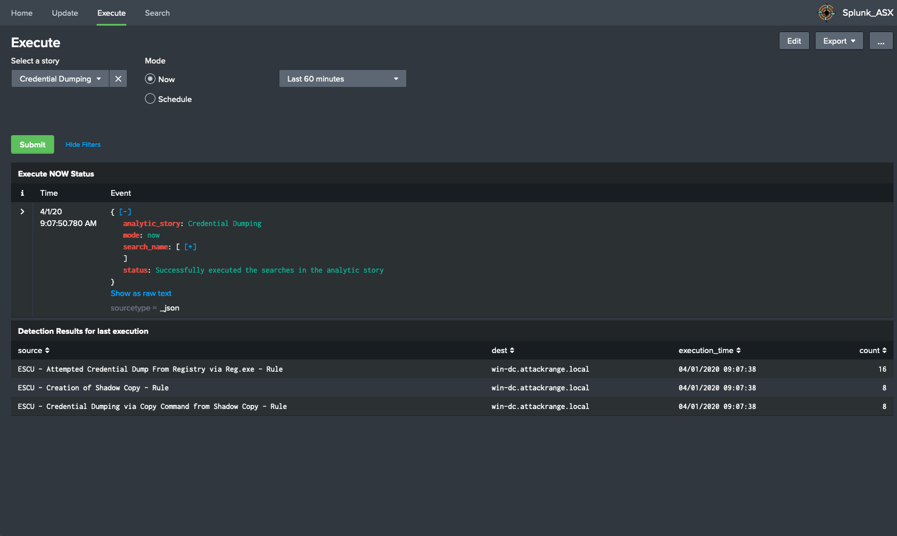

# Analytic Story Execution (ASX)

----

## Description:

This application allows you to execute and schedule [Splunk's Analytic Stories](https://github.com/splunk/security-content). Instead of running each search individually, analysts can use this app to execute and preview the results of executing or scheduling an Analytic Story end-to-end in their environments. The results of the Analytic Stories are stored in the ```index=asx```, which are used to populate the Home dashboard. Furthermore, Analytic Story Execution is capable of updating its Analytic Stories from the [security content api](https://docs.splunkresearch.com/?version=latest).





## Installation

1. Download the [latest release](https://github.com/splunk/analytic_story_execution/releases) and install on your Splunk Search Head.
2. If you do not have Analytic Stories in your Splunk environment, the Splunk Research team regularly releases security analytic stories via [ES Content Updates](https://splunkbase.splunk.com/app/3449/). We recommend you to install the ESCU application to get started quickly.


The app requires the creation of an `index=asx`. Example **index.conf** entry:

```
[asx]
homePath   = $SPLUNK_DB/asx/db
coldPath   = $SPLUNK_DB/asx/colddb
thawedPath = $SPLUNK_DB/asx/thaweddb
```

## Support
Please use the [GitHub issue tracker](https://github.com/splunk/analytic_story_execution/issues) to submit bugs or request features.

If you have questions or need support, you can:

* Post a question to [Splunk Answers](http://answers.splunk.com)
* Join the [#security-research](https://splunk-usergroups.slack.com/messages/C1RH09ERM/) room in the [Splunk Slack channel](http://splunk-usergroups.slack.com)
* If you are a Splunk Enterprise customer with a valid support entitlement contract and have a Splunk-related question, you can also open a support case on the https://www.splunk.com/ support portal

## Author
* [Jose Hernandez](https://twitter.com/d1vious)
* [Bhavin Patel](https://twitter.com/hackpsy)
* [Patrick Bareiss](https://twitter.com/bareiss_patrick)
